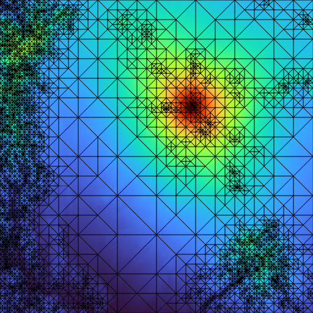

# gmartini

A Go port of the RTIN terrain mesh generator [mapbox/martini](https://github.com/mapbox/martini) by [mourner](https://github.com/mourner).

Additional info on martini can be found at [mourner](https://github.com/mourner)'s Observable notebook, "[MARTINI: Real-Time RTIN Terrain Mesh](https://observablehq.com/@mourner/martin-real-time-rtin-terrain-mesh)". Original algorithm based on the paper ["Right-Triangulated Irregular Networks" by Will Evans et. al. (1997)](https://www.cs.ubc.ca/~will/papers/rtin.pdf).

Sanity checks of porting correctness and static typing nuance provided by references to [kylebarron](https://github.com/kylebarron)'s Cython port [pymartini](https://github.com/kylebarron/pymartini).
